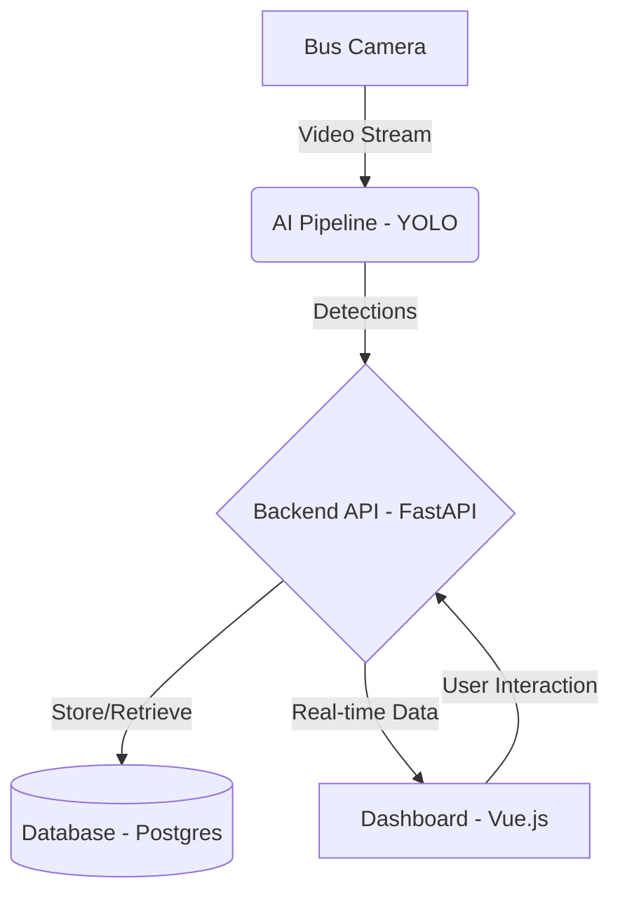

# BusPlus — AI-Powered Road Infrastructure Monitoring Platform
**Every Bus. A Road Inspector.**


BusPlus leverages the existing public transportation network to automatically detect, classify, and track road infrastructure issues like potholes, broken signals, and faded markings. By utilizing cameras mounted on public buses and edge AI models, we turn transit fleets into continuous road monitoring systems.

Our architecture processes live video feeds, extracts frames, detects anomalies using a custom-trained YOLO model, and updates a centralized dashboard in real-time. This allows city planners and maintenance teams to respond swiftly and prioritize repairs efficiently.

## Architecture



## Features

- 🔍 **Real-time road infrastructure detection**
- 🗺️ **Interactive map with issue markers and heatmap**
- 🚌 **Cross-bus verification system**
- 📊 **Analytics dashboard**
- 🤖 **YOLO-based AI detection**
- 🔐 **JWT authentication**
- 📱 **Responsive design**

## Tech Stack

- **Backend:** FastAPI, SQLAlchemy, Pydantic, Alembic
- **Frontend:** Vue.js 3, Vite, Tailwind CSS, Leaflet
- **AI/ML:** PyTorch, Ultralytics YOLOv8, OpenCV
- **Database:** PostgreSQL, Redis
- **DevOps:** Docker, Docker Compose

## Quick Start

### 1. Clone the repo
```bash
git clone https://github.com/yourusername/busplus.git
cd busplus
```

### 2. Option A: Local Development (without Docker)

**Backend:**
```bash
cd backend
pip install -r requirements.txt
uvicorn app.main:app --reload
```

**Frontend:**
```bash
cd frontend
npm install
npm run dev
```

### 3. Option B: Docker Compose
```bash
docker-compose up --build
```

### 4. Access

- **Frontend:** http://localhost:5173
- **Backend API:** http://localhost:8000
- **API Docs:** http://localhost:8000/docs

### 5. Default credentials
- **Email:** `admin@busplus.com`
- **Password:** `admin123`

## Detection Categories

1. **POTHOLE**: Damage to the road surface
2. **CRACK**: Longitudinal or transverse cracks
3. **FADED_MARKING**: Lane or pedestrian crosswalk markings wearing out
4. **BROKEN_SIGNAL**: Traffic light malfunctions
5. **MISSING_SIGN**: Traffic signs absent or heavily damaged
6. **OBSTACLE**: Debris or unauthorized objects blocking lanes
7. **WATER_LOGGING**: Water accumulation on the road surface

## API Documentation

Key endpoints:
- `POST /api/v1/auth/login` - Authenticate and obtain JWT
- `GET /api/v1/issues` - Retrieve a list of reported issues
- `POST /api/v1/detections` - Submit a new detection payload from a bus

Visit `http://localhost:8000/docs` for the interactive Swagger UI.

## Cross-Bus Verification
To prevent false positives, BusPlus uses a spatial-temporal verification system. An issue is marked as "verified" only if it is detected multiple times by different buses within a configurable radius (`ISSUE_CLUSTER_RADIUS_METERS`) and timeframe.

## Mock AI Mode
For development, `MOCK_AI=true` can be set in the `.env` file. This bypasses the heavy YOLO model inference and simulates detections, allowing developers to work on the backend and frontend without a GPU or the actual AI weights.

## Project Structure
```text
.
├── ai/
├── backend/
│   ├── alembic/
│   ├── app/
│   └── tests/
├── frontend/
├── sample_data/
├── docker-compose.yml
├── .env.example
└── README.md
```

## Configuration

| Variable | Description | Default |
|----------|-------------|---------|
| `DATABASE_URL` | Database connection string | `sqlite:///./busplus.db` |
| `SECRET_KEY` | JWT secret key | `busplus-secret-key-change-in-production` |
| `MOCK_AI` | Enable mocked AI for dev | `true` |
| `ISSUE_CLUSTER_RADIUS_METERS`| Distance to cluster similar issues | `20` |

## License
MIT
